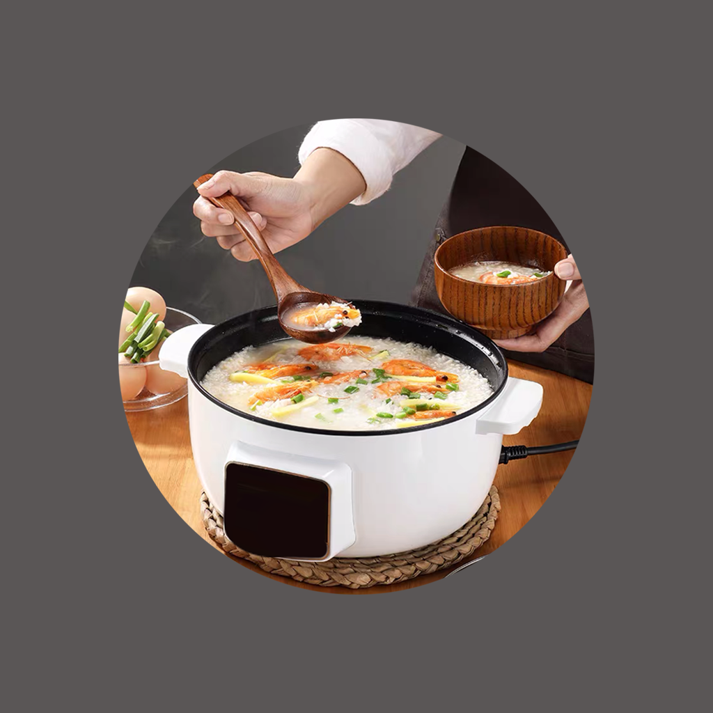

## Welcome to My Rice Porridge Cooking Record

Do your children and family like porridge, too? For example, seafood porridge, millet porridge and vegetable porridge are not only delicious and nutritious, but also easily digested and absorbed. You can record the cooking skills, time, food materials and other details of each time you cook porridge. You can organize this information into a list to help you analyze and improve the cooking method of each porridge, so that you can cook delicious and healthy porridge for your family and children.

If you have any questions, you can either leave a message or send the questions to our email address.

We will answer them for you in the first time.

### Address: BeatriceArlenexSgPdE@yahoo.com

Thank you!
